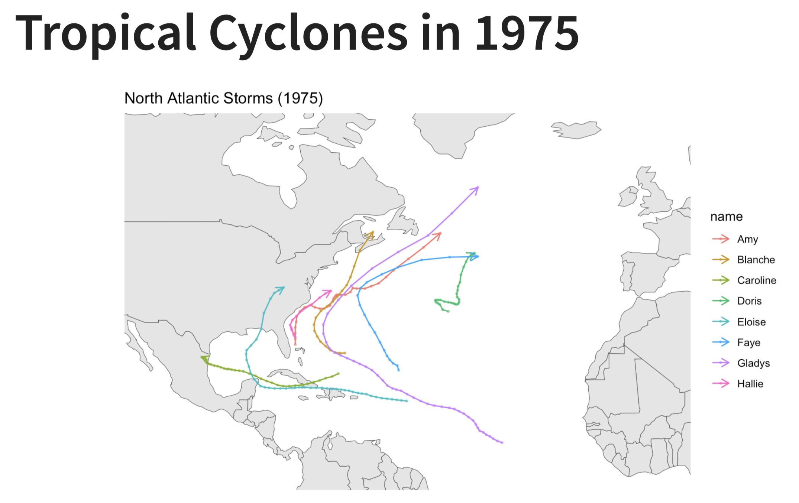
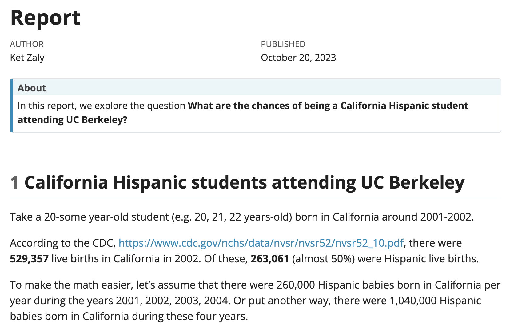
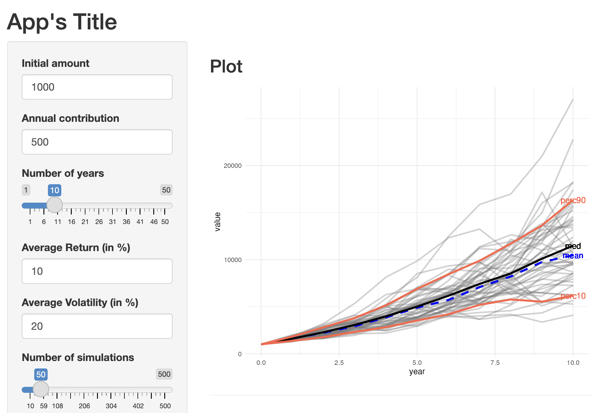

Take a look at some of my work and projects.

\

## Air Quality Dashboard

A brief dashboard exploring air quality trends. [Dashboard](https://pub7-erin-yang.netlify.app/)

{width=70% fig-align="center"}

## Nice Report

A guesswork on the chance of being a Hispanic student enrolled at a higher education institution from a distant civilization.
[Report](report/hispanic-enrollment.html)

{width=70% fig-align="center"}

## Awesome Shiny App

Shiny webapp to create a calculator that simulates investing in an index 
fund over a certain period of time, assuming a variable rate of return.
<a href="https://fakeuser.shinyapps.io/shinyapp1" target="_blank">https://fakeuser.shinyapps.io/shinyapp1</a>

{width=70% fig-align="center"}
